# Portfolio Evaluator

A personal wealth dashboard for Indian investors. Import holdings from any major broker, track your stocks and mutual funds in one place, and get benchmark comparisons, risk metrics, tax estimates, and allocation analysis — all running locally with your data staying private.

Built by [Yashsav Gupta](https://www.linkedin.com/in/yashsav-gupta/)

---

## Screenshots

### Dashboard

<table>
  <tr>
    <td>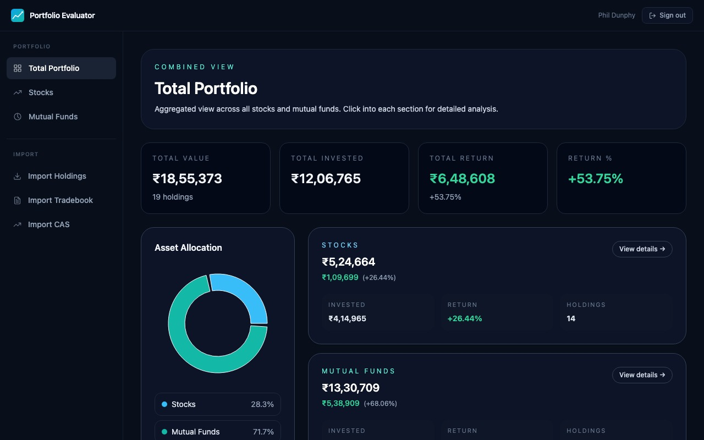<br/><sub><b>Total Portfolio</b> — combined stocks + MF view with asset allocation</sub></td>
  </tr>
</table>

### Stocks

<table>
  <tr>
    <td>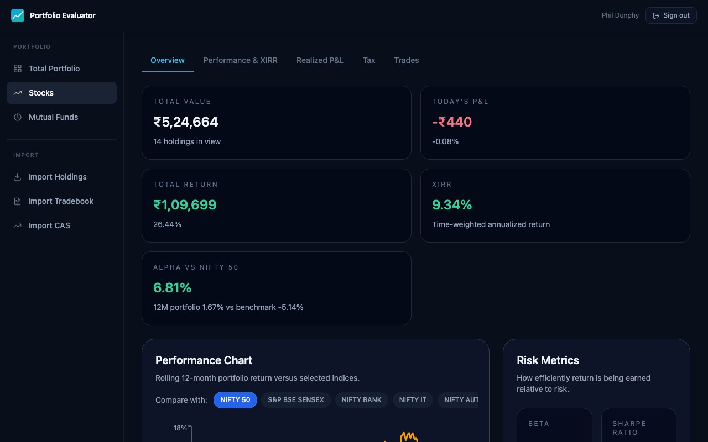<br/><sub><b>Overview</b> — XIRR, alpha vs Nifty 50, today's P&L</sub></td>
    <td>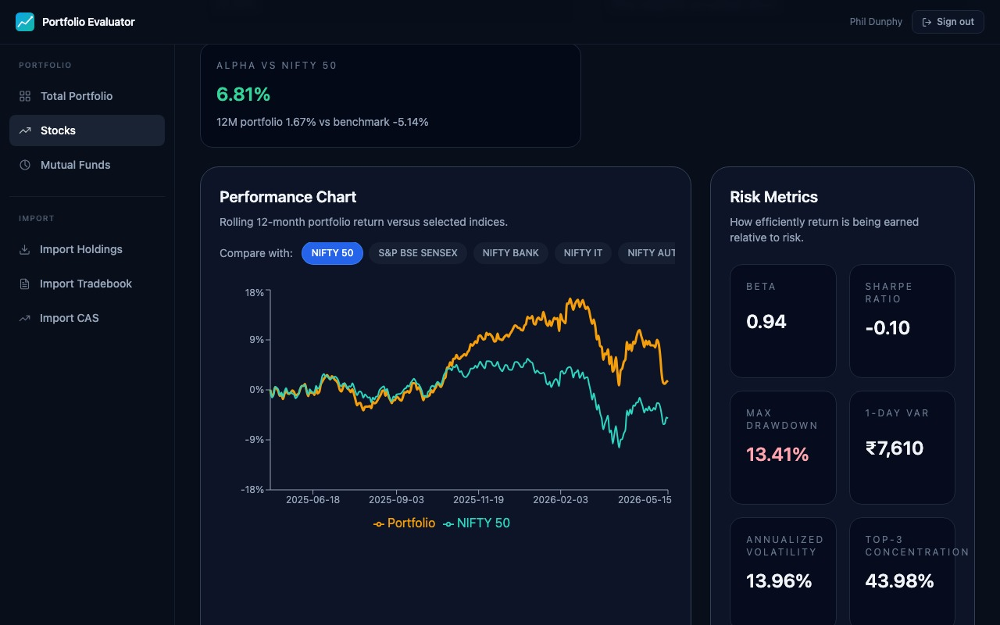<br/><sub><b>Performance Chart</b> — rolling returns vs benchmark + risk panel</sub></td>
  </tr>
  <tr>
    <td>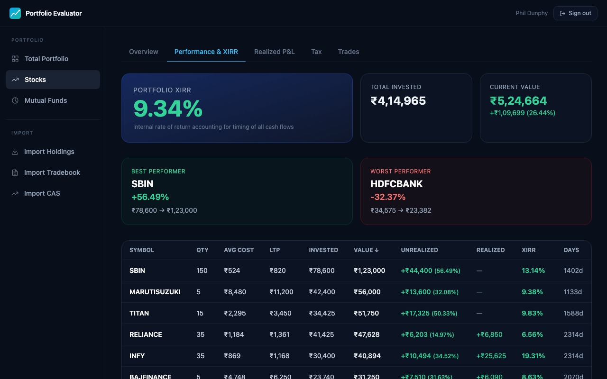<br/><sub><b>Performance & XIRR</b> — best/worst performers, full holdings table</sub></td>
    <td>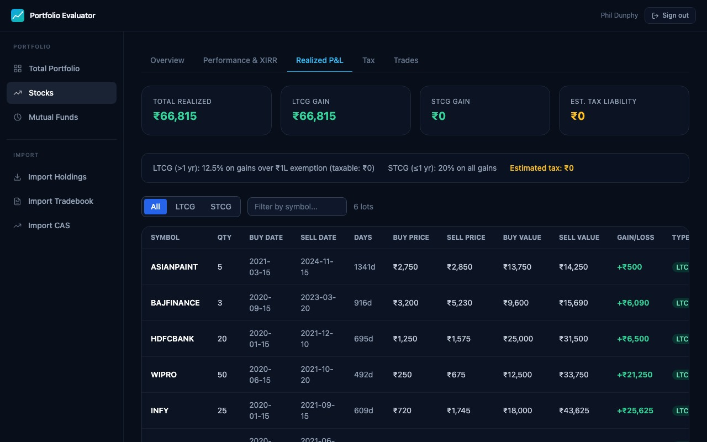<br/><sub><b>Realized P&L</b> — LTCG/STCG breakdown with per-lot detail</sub></td>
  </tr>
  <tr>
    <td>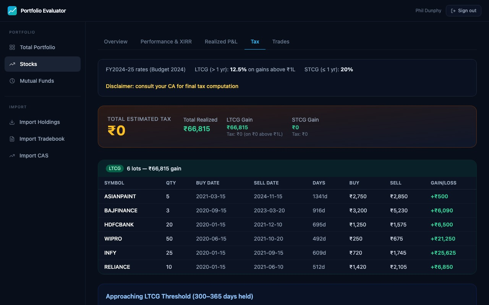<br/><sub><b>Tax Planner</b> — estimated liability at current FY rates</sub></td>
    <td>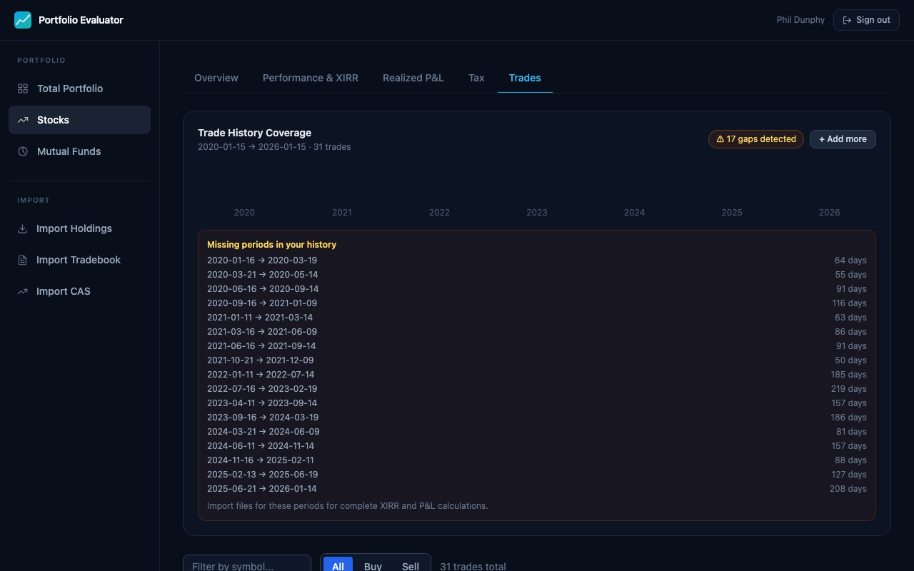<br/><sub><b>Trade History</b> — coverage timeline and gap detection</sub></td>
  </tr>
</table>

### Mutual Funds

<table>
  <tr>
    <td>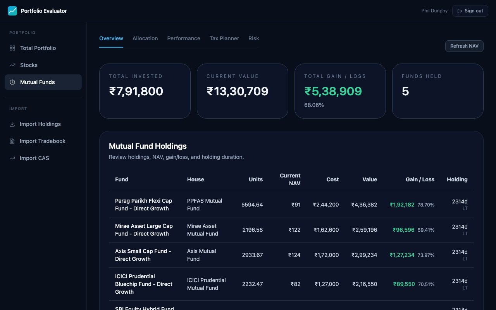<br/><sub><b>Overview</b> — NAV, gain/loss, holding duration per fund</sub></td>
    <td>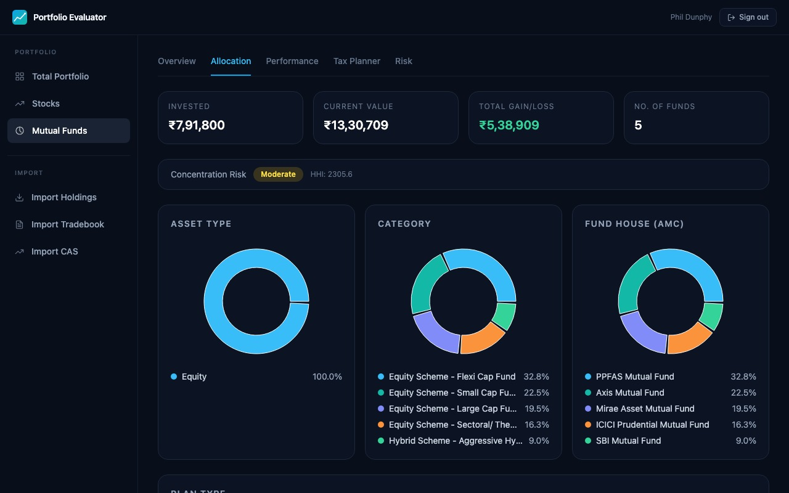<br/><sub><b>Allocation</b> — asset type, category, and AMC breakdown</sub></td>
  </tr>
  <tr>
    <td>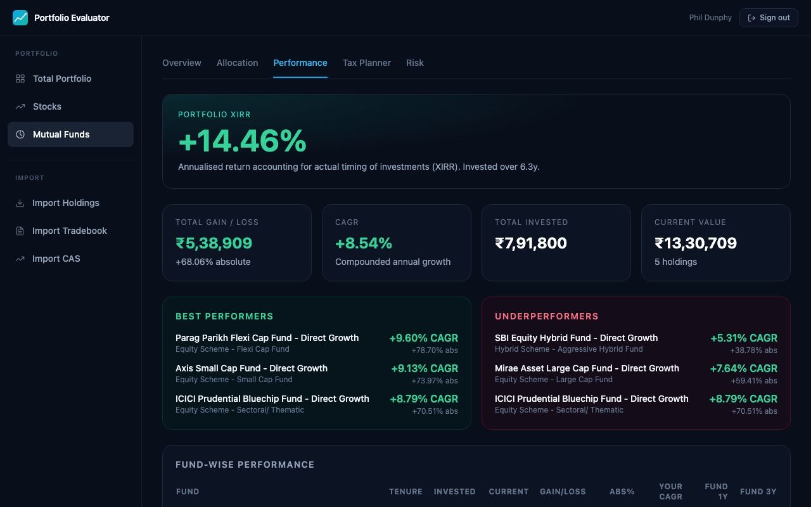<br/><sub><b>Performance</b> — portfolio XIRR, CAGR, best vs underperformers</sub></td>
    <td>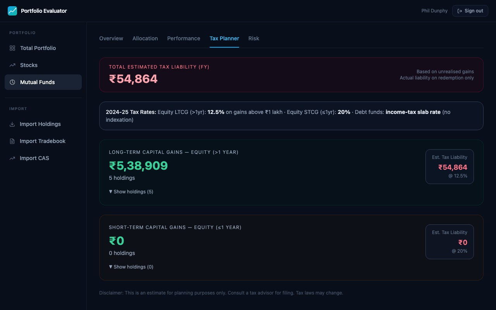<br/><sub><b>Tax Planner</b> — LTCG / STCG split with estimated liability</sub></td>
  </tr>
  <tr>
    <td>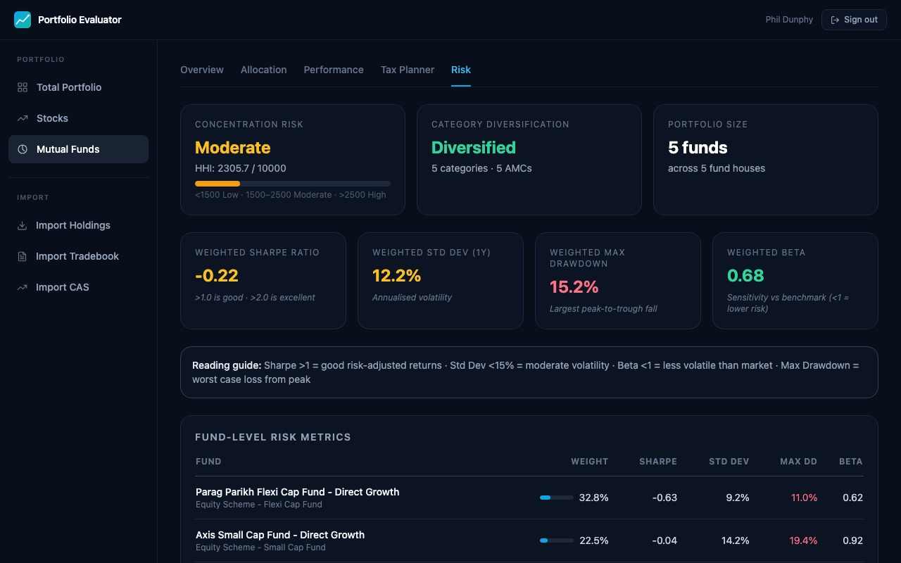<br/><sub><b>Risk</b> — Sharpe ratio, std dev, max drawdown, beta per fund</sub></td>
  </tr>
</table>

---

## Features

**Stocks**
- Upload holdings from Zerodha, Groww, Upstox, Angel One, or HDFC Securities — auto-detected from the CSV/Excel format
- Portfolio dashboard with sector allocation, valuation signals, and promoter holding trends
- Benchmark comparison against NIFTY 50
- Risk analysis — concentration, volatility, drawdown
- Tradebook import (Zerodha, Groww, Upstox, Angel One) for FIFO P&L and trade history

**Mutual Funds**
- Import from INDmoney, Kuvera, Groww, or any generic MF holdings CSV
- CAS (Consolidated Account Statement) support — CAMS and KFintech mailbacks accepted
- Allocation breakdown by category, fund house, and asset type
- Performance tracking with XIRR and CAGR per fund
- Risk metrics — Sharpe ratio, standard deviation, max drawdown, beta vs NIFTY 50
- LTCG/STCG tax estimates and harvest opportunities

**General**
- JWT-based authentication
- Private by default — your data never leaves your own instance
- SQLite for local use, PostgreSQL for production

---

## Tech Stack

| Layer | Tech |
|---|---|
| Frontend | Next.js 14, React 18, TypeScript, Tailwind CSS, Recharts |
| Backend | FastAPI, SQLAlchemy 2, Alembic, Pydantic 2 |
| Database | SQLite (default) · PostgreSQL (production) |
| Data sources | mfapi.in, yfinance, AMFI India |

---

## Local Setup

### Prerequisites

- Python 3.9+
- Node.js 18+

### 1. Backend

```bash
cd backend
python3 -m venv .venv
source .venv/bin/activate        # Windows: .venv\Scripts\activate
pip install -r requirements.txt
cp .env.example .env             # then edit .env
alembic upgrade head
uvicorn app.main:app --host 127.0.0.1 --port 8000 --reload
```

**`backend/.env`**

```env
DATABASE_URL=sqlite:///./portfolio_evaluator.db
SECRET_KEY=change-me-use-a-long-random-string
API_PREFIX=/api
ZERODHA_API_KEY=
ZERODHA_API_SECRET=
```

Generate a strong secret key:

```bash
python3 -c "import secrets; print(secrets.token_hex(32))"
```

### 2. Frontend

```bash
cd frontend
npm install
cp .env.example .env.local       # default values work for local dev
npm run dev
```

**`frontend/.env.local`**

```env
NEXT_PUBLIC_BACKEND_URL=http://127.0.0.1:8000
```

### 3. Open the app

| Service | URL |
|---|---|
| App | http://localhost:3000 |
| API | http://localhost:8000 |
| API docs | http://localhost:8000/docs |

---

## Importing Data

Upload your files at `/import`. The app auto-detects the broker from the column headers — no manual selection needed.

### Stock Holdings

| Broker | How to export |
|---|---|
| **Zerodha** | Console → Portfolio → Holdings → Download (Excel) |
| **Groww** | Stocks → Holdings → Download |
| **Upstox** | Portfolio → Holdings → Download CSV |
| **Angel One** | Portfolio → Holdings → Export |
| **HDFC Securities** | My Portfolio → Export |

### Mutual Fund Holdings

| Source | How to export |
|---|---|
| **INDmoney** | Mutual Funds → Export Holdings CSV |
| **Kuvera** | Portfolio → Download → Holdings CSV |
| **Groww** | Mutual Funds → Holdings → Download |
| **CAMS / KFintech CAS** | Request a mailback statement; upload the CSV |
| **Generic CSV** | Any CSV with Fund Name, Units, NAV, Current Value columns |

### Tradebooks (for P&L and trade history)

Zerodha, Groww, Upstox, and Angel One tradebook CSVs are all supported. Upload at `/import-tradebook`.

---

## Production Deployment

1. Set `DATABASE_URL` to a PostgreSQL connection string
2. Set a strong `SECRET_KEY`
3. Update CORS origins in `backend/app/main.py` to your domain
4. Run `alembic upgrade head` on first deploy
5. Build the frontend: `npm run build && npm run start`
6. Serve behind HTTPS (nginx, Caddy, or Cloudflare)

---

## Project Structure

```
.
├── backend/
│   ├── app/
│   │   ├── api/          # Route handlers
│   │   ├── models/       # SQLAlchemy models
│   │   ├── schemas/      # Pydantic schemas
│   │   ├── services/     # Business logic
│   │   └── core/         # Config, security, JWT
│   ├── alembic/          # Database migrations
│   └── requirements.txt
├── frontend/
│   ├── app/              # Next.js app directory
│   ├── components/       # Shared UI components
│   └── lib/              # API helpers, auth utils
├── docs/
│   └── screenshots/      # UI screenshots
└── README.md
```

---

## License

MIT
